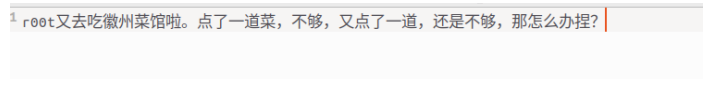
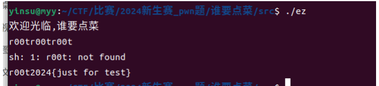
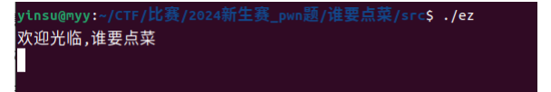
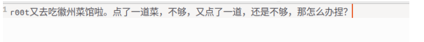
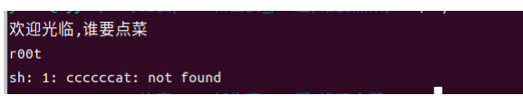
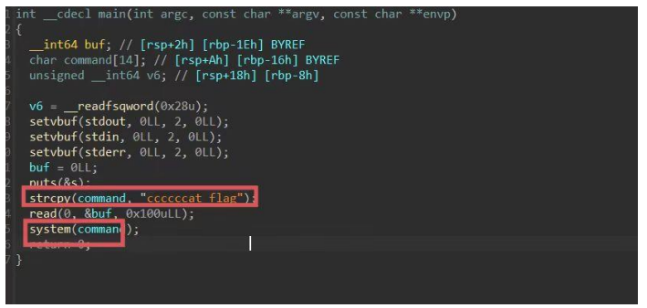
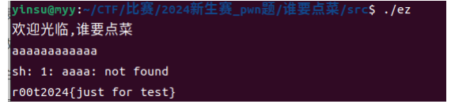

因为 pwn 题目的特殊性，基本知识了解的不深刻，做题会有些难度， 但本题有基础的同学可以做，萌新也可以通过题目描述找到答案哦 

### 萌新思路：

1. 运行程序：

   

2.题目描述

3.题目描述可以看出，点了一道不够，又点了一道还不够，那咋办呢，点第三道试试

**可以看出输入 root 三次得到了 flag，是不是有点脑经急转弯的**

### 基础思路：

1.运行程序：

2.根据题目描述：

3.是 r00t 要点菜，输入 r00t 试试

输出有问题

4.将可执行文件拖入 IDA 反编译源码

可以看到 

① 将 ccccccat flag 赋值给 command，代码最后执行了这个命令，但是显而易 见，正确的命令应该是 cat flag 而不是 ccccat flag 

② 有一个 read 函数可以输如 0x100 个字节的数据，但是 buf 的长度是 8 个字节， 因为__int64 类型是 long long 类型的，那么多输入的数据就会溢出覆盖 buf 到这里，如果对 pwn 有些基础了解的同学应该可以想到，我们现在的思路就是利 用无限制长度输入的 read 函数去将 ccccccat flag 覆盖为……\ncat flag,那么 system 函数遇到\n,会将前半部分当成一个命令，\n 符后当成另一个命令，也就执行了我 们的 cat flag。

5.那么应该输入多少字节实现覆盖呢

这个时候有两种办法，一个是用 IDA 查看静态代码，buf 距离 command 是 0x1E-0x16=8 个字节，ccccccat flag 中要覆盖前五个 c，也就是一共 13 个字节，其中第 13 个字节应该是\n,前 12 个字节随意，如下

最后多说一句 r00tr00tr00t\n 刚好也可以满足上面的 12 个字节加\n

