1.拿到程序checksec查看程序没有canary检测，也没有pie偏移，是32位程序

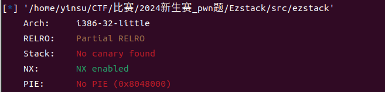

2.运行一下，程序接受一个输入，再将我们的输入回显

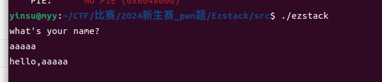

3.将二进制文件放入IDA

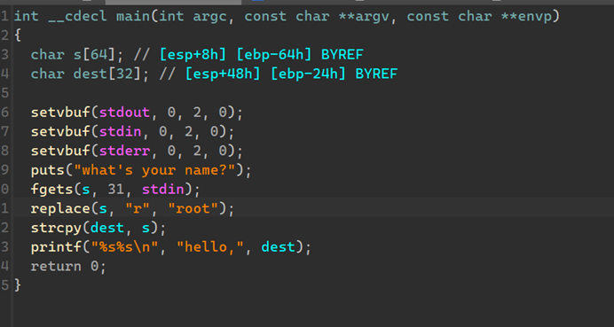

我们输入的地方是fgets，fgets函数允许我们输入最多31个字符，而s数组的大小是64，要想在这溢出是不可能的，接着向下分析

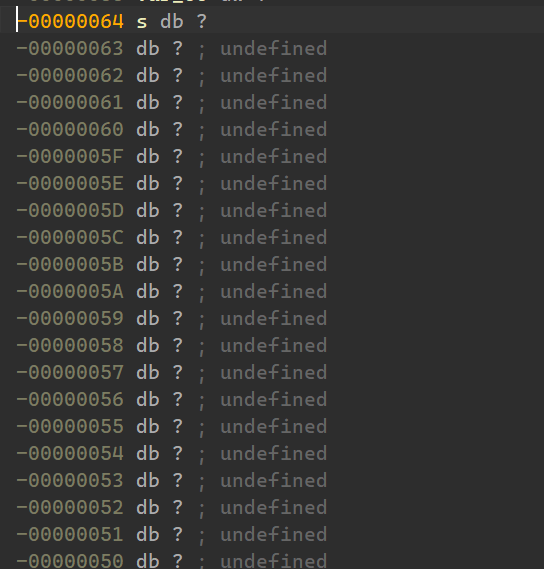

replace函数引起了我们的注意，在点进replace函数之前我们就应该想到，它的作用就是替换字符串，点进去发现它的逻辑主要在这几个地方，其中s和s2，n是我们传入函数的参数，s即为用户输入的字符串，“r”,对应的形参是s2，’root’对应形参src

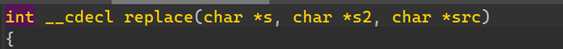

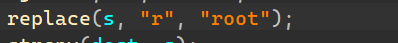
 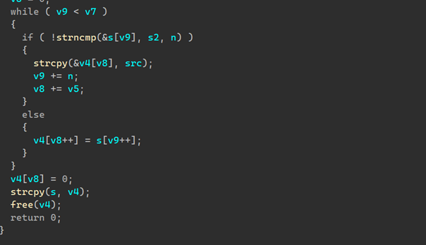

通过对程序分析，发现他就是把我们输入的字符串中的r统统替换成root四个字符，所以尽管我们只能输入31个字符，但如果我们输入31’r’，就会被替换为31个‘root’

31*4也就是124

回到main函数继续分析，被替换后的s字符串赋给了dest，而dest这个数组长度只有32，也就是让我们有了溢出的可能

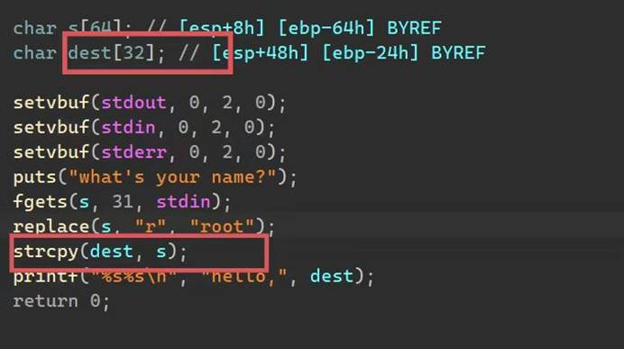

4.接下来就看看溢出多少个字节，有没有system(“/bin/sh”)函数，有system则直接跳到system函数执行

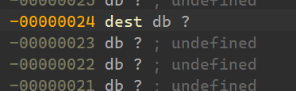

可以看出溢出字节是0x24+4

5.程序中也存在可以直接利用的system函数

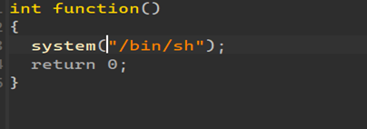

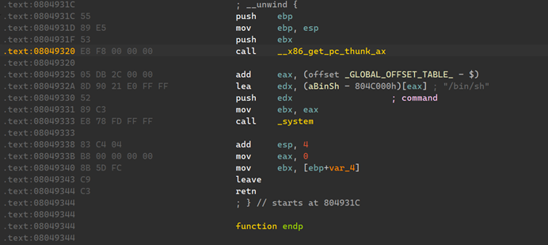

调用system(“/bin/sh”)的function函数地址为0x804931C

6.攻击脚本如下

本地打通后注释掉process，启用remote连接

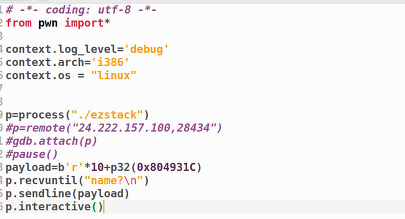

 