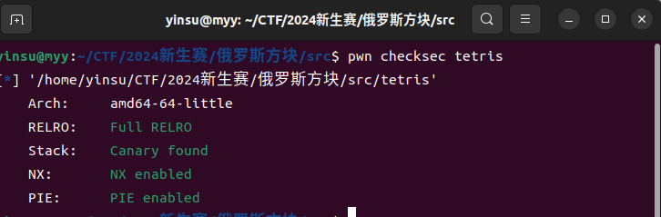
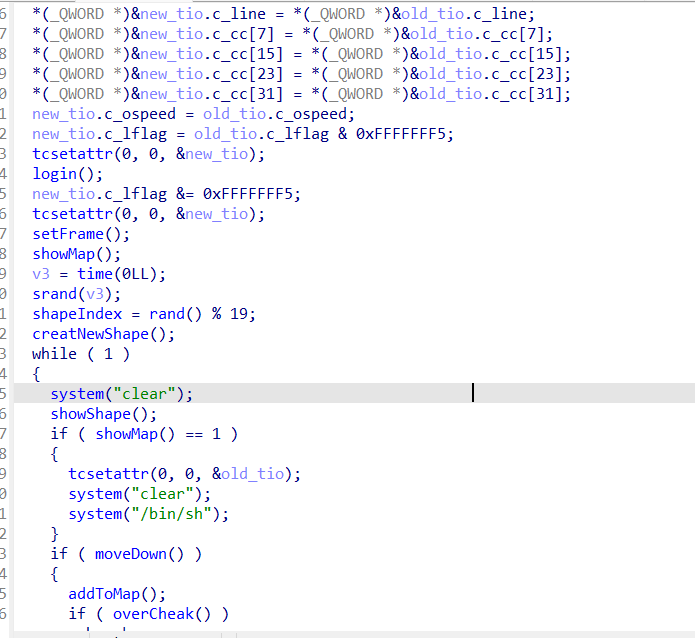
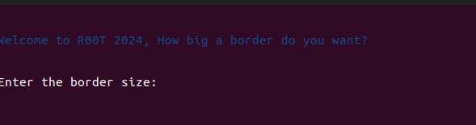
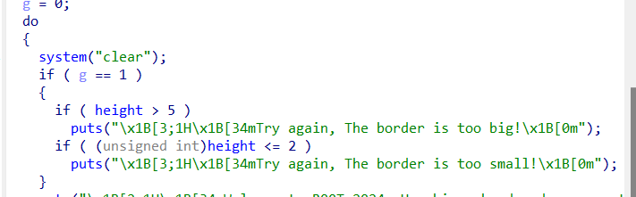
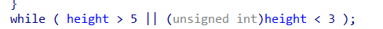
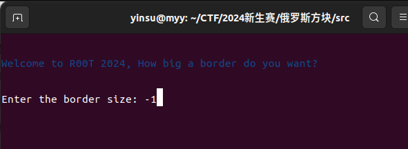
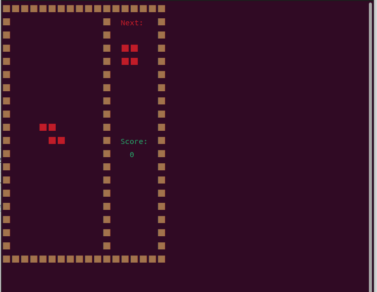
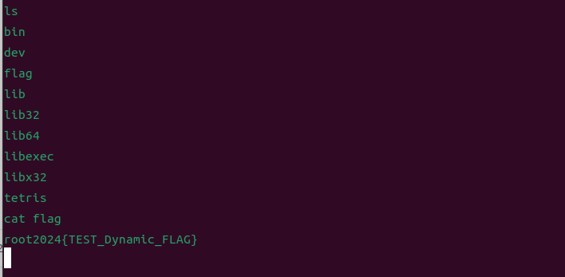

1.checksec查看文件基本信息，发现是64位程序

2.拿到可执行文件放在IDA里看一下源码，64位程序用64位IDA打开,一进主函数就发现了system("bin/sh")

看看题目的描述和提示：让我们输入一个游戏需要的边界高度

经过测试还有源码分析

输入大于5的数或者大于0小于3的数都是不被允许的

目前看来只能输入4或者5，但是运行起来发现，4或5的边界根本不足以完成消除一行的目标，真的有人拼手速能达到吗hh，如果有私信我请你喝奶茶哈哈辛苦了😀

再看题目还有一个提示，整数溢出，在这里检验的时候，是说height不能大于5，也不能小于3，但是仔细观察，判断是否小于三的时候用的是unsigned int，去学习了整数溢出的相关知识就会知道，int类型的负数转换成unsigned int时，会变成很大的正数，所以只要我们输入随便一个负数就完成了绕过

这个时候游戏就开始了，他给了我们足够大的边界，消除一行就很简单了

消除一行后，会弹出shell，ls，cat flag，完成

