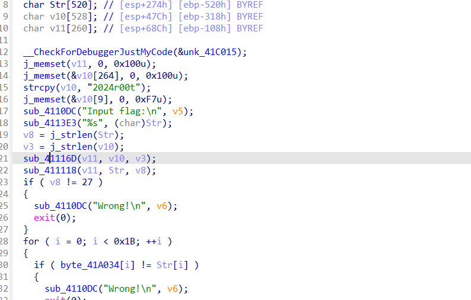
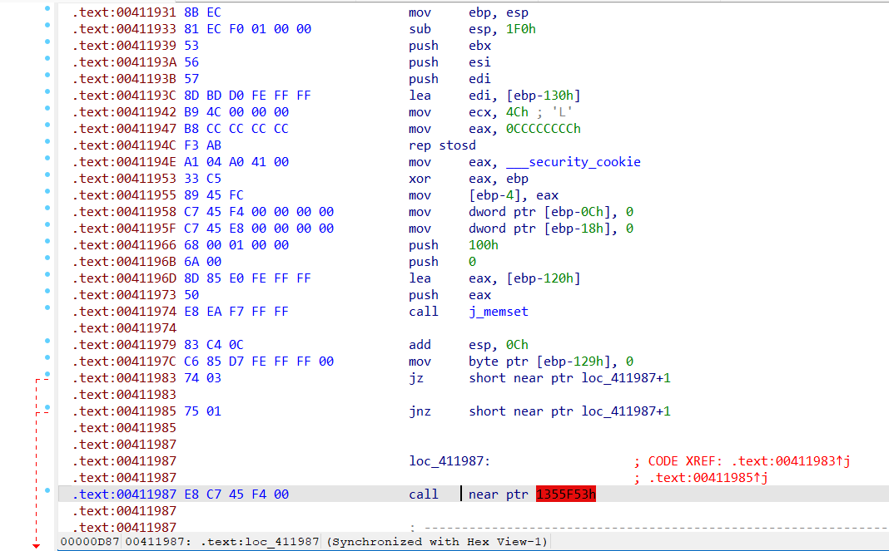
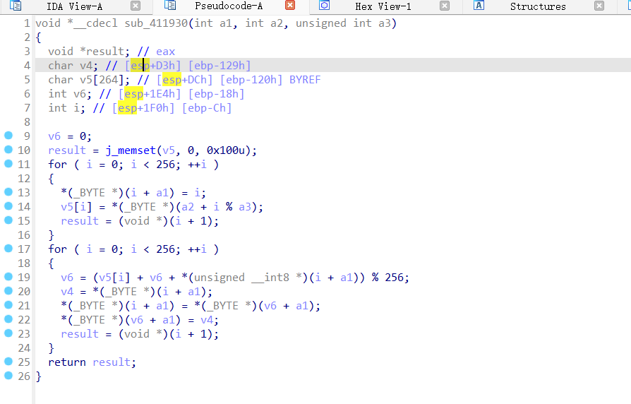
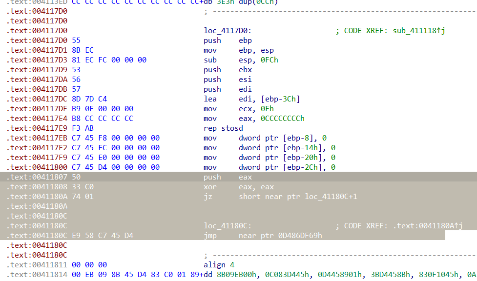
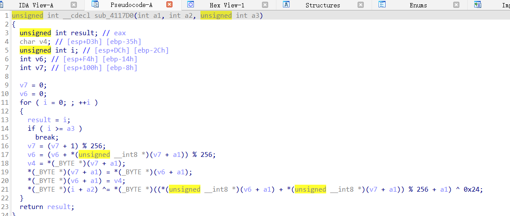

# 复仇？！

可以发现sub_41116D和sub_411118两个函数无法识别



查看汇编会发现是加了花指令



第一个花是jz和jnz的互补跳转，将E8 nop掉即可

在函数起始位置按p重新编成函数



第二个花是是一个永真跳转



同样将E9的jmp nop掉即可



可以根据两个函数发现还是RC4加密，但是做了魔改，在加密函数的最后一步异或了0x24，所以不能直接用工具了，需要自己写脚本解密

exp如下

```
#include <stdio.h>
#include <string.h>
#include<stdlib.h>
#include<stdint.h>

void rc4_init(unsigned char* s, unsigned char* key, unsigned long Len)
{
    int i = 0, j = 0;
    char k[256] = { 0 };
    unsigned char tmp = 0;

    for (i = 0; i < 256; i++)
    {
        s[i] = i;
        k[i] = key[i % Len];
    }
    for (i = 0; i < 256; i++)
    {
        j = (j + s[i] + k[i]) % 256;
        tmp = s[i];
        s[i] = s[j];
        s[j] = tmp;
    }
}

void rc4_crypt(unsigned char* s, unsigned char* Data, unsigned long Len)
{
         

    int i = 0, j = 0, t = 0;
    unsigned long k = 0;
    unsigned char tmp;
    
    for (k = 0; k < Len; k++)
    {
        i = (i + 1) % 256;
        j = (j + s[i]) % 256;
        tmp = s[i];
        s[i] = s[j];
        s[j] = tmp;
        t = (s[i] + s[j]) % 256;
        Data[k] =Data[k] ^ s[t] ^ 0x24 ;
    }
}

int main()
{
    unsigned char s[256] = { 0 }, s2[256] = { 0 };
    char key[] =  "2024r00t" ;
    unsigned char flag[] = {0x76, 0xEF, 0x08, 0x29, 0xD0, 0x75, 0x1C, 0x95, 0xA2, 0x1D, 
  0xC2, 0xAC, 0xDD, 0x41, 0xEB, 0x5E, 0x58, 0xE0, 0x43, 0xBE, 
  0x9D, 0xB3, 0x63, 0xE9, 0x95, 0x88, 0x47};
    int i = 0;
    int len =27;
    
    rc4_init(s, (unsigned char*)key, strlen(key));
    rc4_crypt(s, flag, len);
    
    for(int i=0;i<len;i++){
        printf("%c", flag[i]);
    }

    return 0;
}
```

