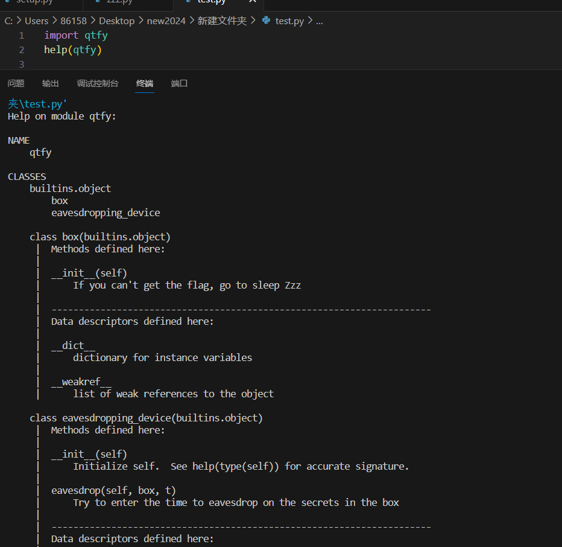
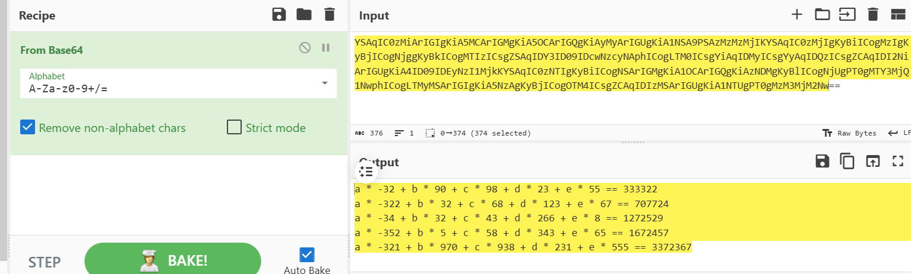

# 窃听风云

附件是一个whl文件，可以通过pip安装到自己的python上，可以通过help命令了解详细内容



根据其中的方法与提示，写出如下脚本获取box中的信息

```
import qtfy
help(qtfy)

b = qtfy.box()
e = qtfy.eavesdropping_device()
for t in range(10000):
    e.eavesdrop(b,t)
```

结果如下

YSAqIC0zMiArIGIgKiA5MCArIGMgKiA5OCArIGQgKiAyMyArIGUgKiA1NSA9PSAzMzMzMjIKYSAqIC0zMjIgKyBiICogMzIgKyBjICogNjggKyBkICogMTIzICsgZSAqIDY3ID09IDcwNzcyNAphICogLTM0ICsgYiAqIDMyICsgYyAqIDQzICsgZCAqIDI2NiArIGUgKiA4ID09IDEyNzI1MjkKYSAqIC0zNTIgKyBiICogNSArIGMgKiA1OCArIGQgKiAzNDMgKyBlICogNjUgPT0gMTY3MjQ1NwphICogLTMyMSArIGIgKiA5NzAgKyBjICogOTM4ICsgZCAqIDIzMSArIGUgKiA1NTUgPT0gMzM3MjM2Nw==

可以知道是base64编码，解码：



利用z3算出abcde的值

```
from z3 import *

a,b,c,d,e = Ints('a b c d e')
solver = Solver()
solver.add(a * -32 + b * 90 + c * 98 + d * 23 + e * 55 == 333322)
solver.add(a * -322 + b * 32 + c * 68 + d * 123 + e * 67 == 707724)
solver.add(a * -34 + b * 32 + c * 43 + d * 266 + e * 8 == 1272529)
solver.add(a * -352 + b * 5 + c * 58 + d * 343 + e * 65 == 1672457)
solver.add(a * -321 + b * 970 + c * 938 + d * 231 + e * 555 == 3372367)

solver.check()
print(solver.model())
```

[d = 4544, e = 1754, a = 123, b = 777, c = 677]

flag：r00t2024{123_777_677_4544_1754}